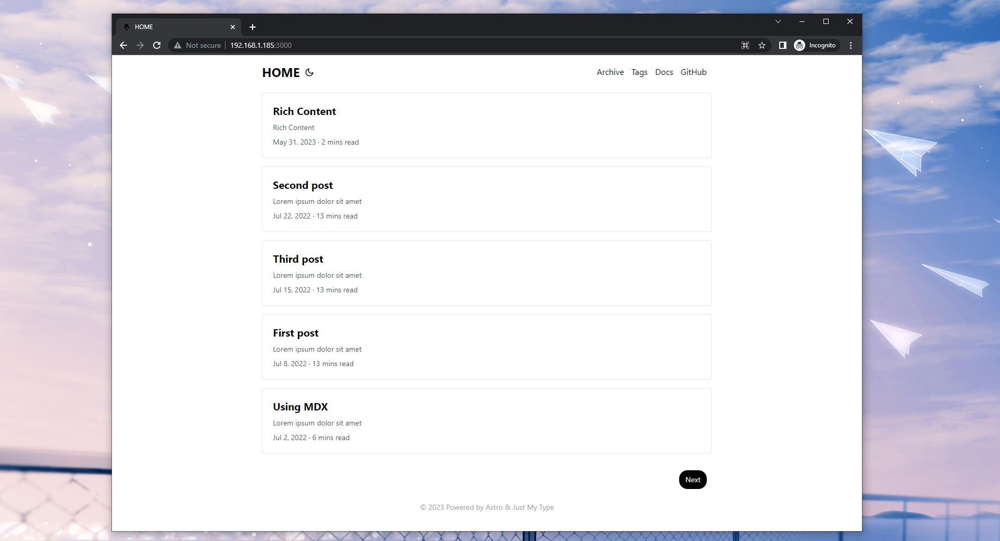
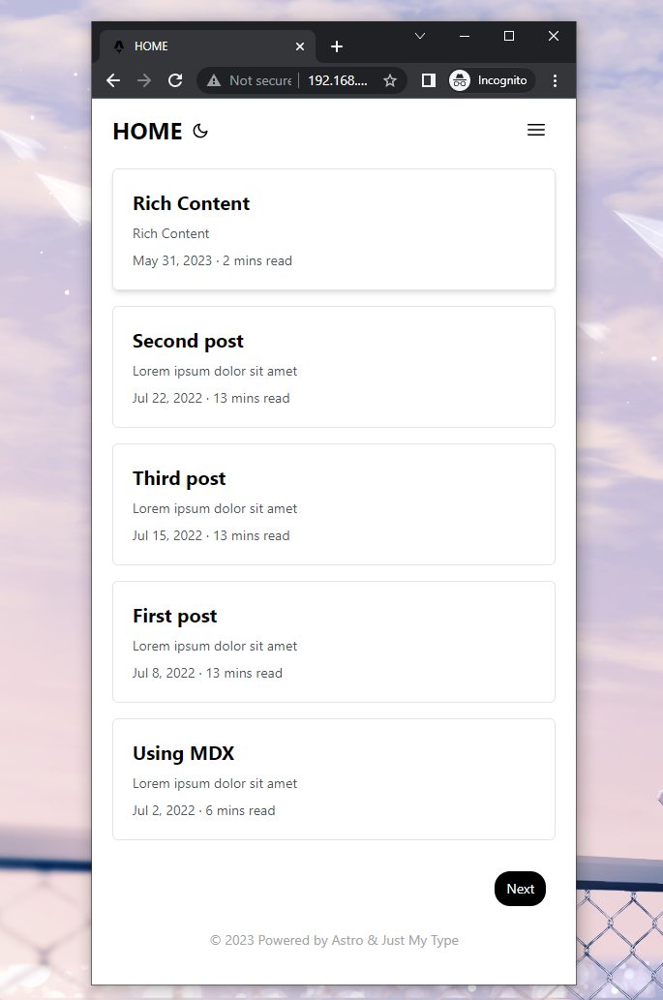

<h1 align=center>just my type blog</h1>

just my type blog is a theme based on [hugo-PaperMod](https://github.com/adityatelange/hugo-PaperMod/) Easier customization with Astro

## Overview





## install

clone just-my-type-blog

```
git clone git@github.com:yemo0/just-my-type-blog.git
```

npm install

```
cd just-my-type-blog
npm install
```

## config

Available options to `consts.ts`

Modify to your website domain `astro.config.mjs`

```
export default defineConfig({
  site: 'your domain',
  integrations: [mdx(), sitemap(), tailwind()]
});
```

## ToDo

- Fix dark mode
- Add post details next page and prev page
- Perfecting the details